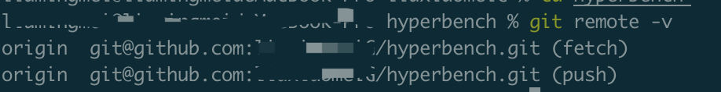

### fork

1. 在github上打开hyperbench这个项目[https://github.com/hyperbench/hyperbench]

2. 点击Fork按钮，稍等片刻，此项目便会出现在自己的仓库中

   

### Clone

1. 进入自己fork的项目，点击Code按钮，复制url

   

2. 将fork的项目clone到本地，执行命令

   ```shell
   git clone git@github.com:****/hyperbench.git
   ```

   命令执行完之后会出现hyperbench目录

3. 执行`git remote -v`命令，可以看到此时本地仓库只与自己的远程仓库建立了连接

   

4. 与上游仓库建立连接，即与开源的hyperbench建立连接，执行命令

   ```shell
   git remote add upstream git@github.com:hyperbench/hyperbench.git
   ```

5. 执行`git remote -v`命令，可以看到此时本地仓库与开源的远程仓库也建立了连接

   

6. 执行`npm install`命令，安装commitizen，便于规范提交代码，执行之后可使用`git cz`代替`git commit`.

### 修改代码

1. 创建分支，例如，需要写代码fix某个issue，ID为25，执行命令

   ```shell
   git checkout -b lmm/fix-25
   ```

2. 修改文件

3. 使用git add、git cz (or git commit)提交修改【注意，提交的commit信息符合git cz的提交规范，可参考https://ruanyifeng.com/blog/2016/01/commit_message_change_log.html， 若】

4. 使用git push origin lmm/fix-25推送当前分支到自己的远程仓库

### 提交pr

1. 在自己的远程仓库找到`New pull request`点击

   

2. 选择之前提交的分支，点击`Create pull request`

   

3. 写好说明、提交即可

### 关于check不通过的问题

github代码有编译和check机制，在你提交pr的时候，项目可能已经有了比较大的变更，而你没有将分支保持与项目同步，所以有可能会导致check失败，pr被无视。

还记得我们在自己本地有一个flink master分支，然后又拉了一个flink-fs分支，然后在flink-fs上进行修改，提交的也是flink-fs，然后又想起了之前有一步是“与上游建立连接”，说到你可能已经知道了master的作用–用于远程代码同步。

所以每次提交pr前，都要先从做代码同步。过程如下：

每次提交前需要先做代码同步，过程如下：

1. 先fetch，执行`git fetch upstream` 

2. 切换到本地仓库的master分支，再rebase上衣仓库的master分支，执行`git rebase upstream/master`

3. 推送master，执行`git push origin master`。此时自己的远程仓库的master分支与上游仓库的master分钟再一致了

4. 然后切换到本地的修改分支，再将本地修改分支rebase自己本地的master分钟，执行`git rebase master`

5. 最后将本地分支再push上去即可。【如果在同步代码前将本地分支推送到到自己的远程仓库了，此时rebase之后commit有所修改，需要使用`git push origin lmm/fix-25 --force-with-lease`】

   